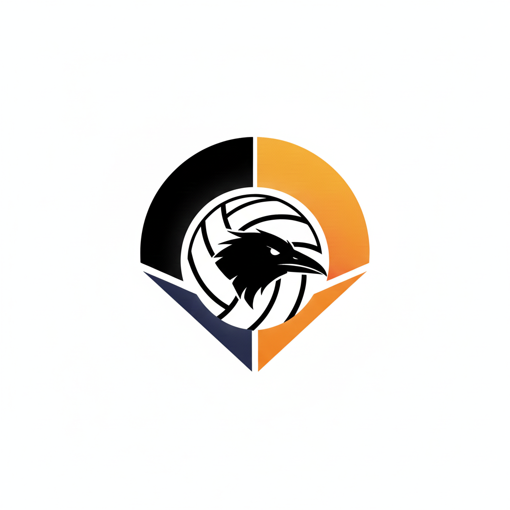

# Tobio

<div align="center">

> **Your Game, Quantified**

### AI-powered volleyball video analysis platform

**🌐 [Try Tobio Live](https://tobio.daniellu.ca/)**

*Alternative link: [tobio-rosy.vercel.app](https://tobio-rosy.vercel.app/)*

<a href="https://tobio.daniellu.ca/" target="_blank">
  
</a>

---

<!-- <p align="center">
  
</p> -->

<video src="https://github.com/user-attachments/assets/b0137905-8728-4bd4-ae50-659d874b5992" controls="controls" autoplay="autoplay" loop="loop" muted="muted" style="max-width: 100%;">
</video>

> *Demo footage*
---

*COMP3106 Final Project | Group 68: Daniel Lu - 101304181*

</div>

## Overview

**Tobio** is a full-stack platform for automated volleyball analytics, combining a React + TypeScript frontend with a FastAPI backend powered by state-of-the-art machine learning models. It enables coaches and players to upload game footage and receive instant, actionable insights.

## Key Features

- **Court Detection & Mapping:** Automatic identification and 3D mapping of volleyball courts.
- **Ball Tracking:** Frame-by-frame trajectory analysis with interpolation for smooth tracking.
- **Player Tracking:** Multi-player detection and tracking using YOLOv11.
- **Serve & Action Recognition:** ML-powered event classification for serves and volleyball actions.
- **Real-Time Web Interface:** Upload videos and view analytics instantly in your browser.
- **AI Chat Agent:** Gemini 2.5 Flash-powered agent for CSV/game data analysis (API key required).
- **Statistical Visualization:** Interactive dashboards and overlays for game metrics.

## Technology Stack

- **Frontend:** React 19, TypeScript, Vite, Framer Motion, Lucide React, react-markdown
- **Backend:** FastAPI, Python 3.x, YOLOv11, OpenCV, AWS S3 (for model storage)
- **ML Training:** Jupyter notebooks, Ultralytics YOLO, TensorBoard
- **Dev Tools:** pnpm, ESLint, TypeScript

### Architecture

```
├── app/
│   ├── frontend/          # React + TypeScript web application
│   └── backend/           # FastAPI service with ML models
├── training/              # Model training pipelines
└── reports/               # Project documentation and research
```

## Technology Stack

**Frontend**
- React 19 with TypeScript
- Vite build system
- Canvas-based video overlay rendering

**Backend**
- FastAPI with Python 3.x
- YOLOv11 for object detection and segmentation
- OpenCV for video processing
- AWS S3 integration for model storage

**Machine Learning**
- Ultralytics YOLO for court and ball detection
- Custom interpolation algorithms for smooth tracking
- TensorBoard integration for training visualization

## Installation

### Prerequisites

- [uv](https://docs.astral.sh/uv/getting-started/installation/) (Python package manager)
- Node.js 18+
- pnpm package manager

### Setup

1. **Install Python dependencies**
   ```bash
   # Training environment (root)
   uv sync

   # Backend only
   cd app/backend && uv sync
   ```
- NOTE: PyTorch is configured for CUDA 11.8 in `pyproject.toml`. To target a different version, change the `[[tool.uv.index]]` URL (e.g. `cu121` for CUDA 12.1, `cpu` for CPU-only).

2. **Install frontend dependencies**
   ```bash
   cd app/frontend/tobio
   pnpm install
   ```

3. **Configure environment**
- **Backend AWS S3 Access Keys**: The current backend pulls my trained models from my AWS S3 bucket, but you may just pull from local. If you are using your own S3 bucket, you will need to define up your AWS access keys.

1. Create the fie `app/backend/.env`
2. Add the following lines:
   ```bash
   AWS_ACCESS_KEY_ID="your_key"
   AWS_SECRET_ACCESS_KEY="your_secret"
   ```

- **Frontend Gemini API Key**: To enable the AI chat agent (Gemini 2.5 Flash) in the frontend, you must add your Gemini API key to the environment:

1. Create or edit the file `app/frontend/tobio/.env`
2. Add the following line:
   ```bash
   VITE_GEMENI_API_KEY="your-gemini-api-key-here"
   ```

## Usage

### Development

**Start backend service**
```bash
cd app/backend
uv run uvicorn main:app --reload --host 0.0.0.0 --port 8000
```

**Start frontend development server**
```bash
cd app/frontend/tobio
pnpm run dev
```

### Training Pipeline

Access the training notebooks for model development:

```bash
cd training
jupyter notebook
```

Available stages:
- `1_court_tracking.ipynb` - Court boundary detection
- `2_ball_tracking.ipynb` - Volleyball trajectory analysis
- `3_player_tracking.ipynb` - Player identification and tracking
- `4_serve_recognition.ipynb` - Serve recognition
- `5_action_classification.ipynb` - Action recognition

## API Reference

### Endpoints

- `POST /process-video` — Full video analysis
- `POST /track-court` — Court detection
- `POST /track-ball` — Ball tracking
- `POST /track-players` — Player tracking

## Contributing

- Open to PRs for new features, bug fixes, and documentation.
- See `reports/` for research and technical documentation.

## License

MIT
